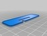
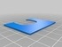
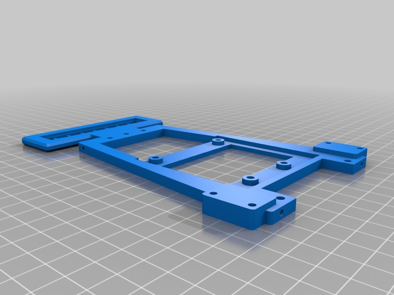

Vector-9000, a fast line follower robot
===============

Description
--------
By Carlosgs and Víctor Uceda. 
 
This robot was designed and built two weeks ahead the Cosmobot 2013 competition (http://www.roboticspot.com/cosmobot/). 

Video: <a href="http://www.youtube.com/watch?v=wgSMBDEtGO0" target="_blank" rel="nofollow">youtube.com/watch?v=wgSMBDEtGO0</a> 

Tech specs: 

 - Arduino Leonardo with CRM Shield + MUX + lots of wire-wrapping 
 - Pololu QTR-8A (RC) and CNY-70 line sensor boards 
 - 7.4V Li-Po battery 
 - LDR sensor array (x4) as an experiment to determine the robot's orientation

Files
--------

 [ SoporteLDR.stl](3D_design/SoporteLDR.stl)  

 [ TercerApoyo.stl](3D_design/TercerApoyo.stl)  

 [ NuevaCover.stl](3D_design/NuevaCover.stl)  

 [ Chasis.stl](3D_design/Chasis.stl)  

 [ CubiertaPololu.stl](3D_design/CubiertaPololu.stl)  

 [ TercerApoyo.scad](3D_design/TercerApoyo.scad)  

 [ LineSensorV2_new.scad](3D_design/LineSensorV2_new.scad)  

 [ CubiertaPololu.scad](3D_design/CubiertaPololu.scad)  

 [ CubiertaCarcasa.scad](3D_design/CubiertaCarcasa.scad)  

 [ Chasis.scad](3D_design/Chasis.scad)  

 [ CubiertaCarcasa.stl](3D_design/CubiertaCarcasa.stl)  

 [ SoporteLDR.scad](3D_design/SoporteLDR.scad)  

Pictures
--------

Tags
--------
ARDUINO , CRM , PLASTIC_VALLEY , PRINTBOT , SHIELD , UAM  

  

License
--------
Vector-9000, a fast line follower robot by carlosgs is licensed under the Creative Commons - Attribution - Share Alike license.  

